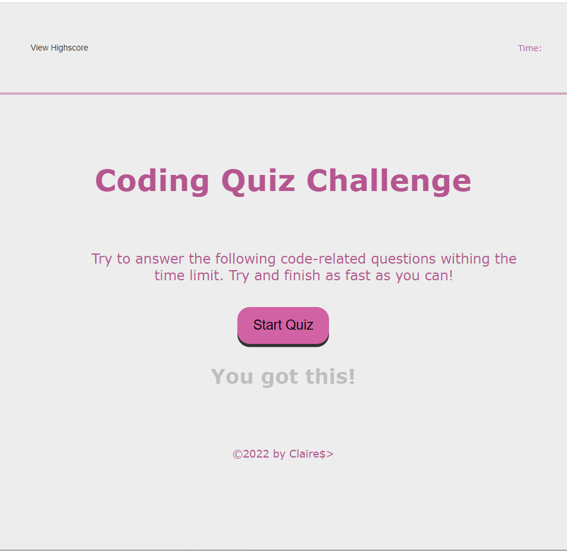

# WEEK 

# Code Quiz - Week 4 challenge
<h2>Javascript quiz</h2>

    <h3>Create a dynamically updated HTML and CSS quiz through javascript testing the user on javascript.</h3>
 GIVEN I am taking a code quiz
WHEN I click the start button
THEN a timer starts and I am presented with a question
WHEN I answer a question
THEN I am presented with another question
WHEN I answer a question incorrectly
THEN time is subtracted from the clock
WHEN all questions are answered or the timer reaches 0
THEN the game is over
WHEN the game is over
THEN I can save my initials and score

<h2> Screen Capture of my quiz </h2>
 

Deplyoment: https://clairecashmore17.github.io/code-quiz/
